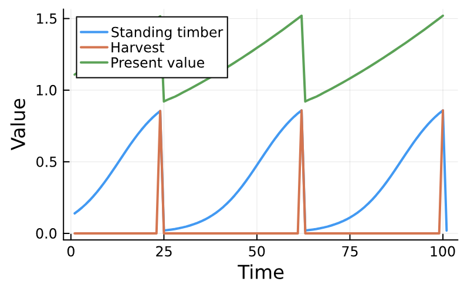

# ValueFunctionIterations.jl

ValueFunctionIterations.jl is a package for solving Markov decision processes (MDP) using the value function iteration algorithm. The library is designed to solve MDPs with continuous state variables, although, it can also accomidate discrete variables. 

## Markov decision processes

Markov decision processes are a type of optimization problem where a sequence of actions $u_t$ are chosen to maximize a sequence of rewards $R$ discounted into the future by a factor $\delta$. The rewards $R(s_t,u_t,X_t)$ depend on the action taken $u_t$, random events $X_t$ and thirds set of variables $s_t$ called state variables

```math
V = \underset{\text{max}}{\{u\}_t}\left\{\sum_{t=0}^{\infty}\delta R(u_t,s_t,X_t) \right\}.
```
The state variables are influnced by the actions $u_t$ creating cause and effect relationships between actions taken in the present and future rewards. These relationships are captured by a function called the state transition function $F(s_t,u_t,X_t)$ which determines the value of the state variables in the next period $s_{t+1}$.

Markov decision provesses find the optimum sequence of action $u_t$ to maximize the discounted sum of rewards given the efect of each action on rewards in the present and on rewards in the future. Markov decision process also allow for there to be uncertianty in the relationship between current actions and future rewards captured by the random variable $X_t$. 

Markov decision process can be solved using the Bellman equation which provides recursively calculates the expected value of the objective $V$ as a function of the current value fo the state variables $s_t$

```math
V(s_t) = \underset{\text{max}}{u_t}\left\{E_X[R(s_t,u_t,X_t)]+\delta E_X[V(s_t,u_t,X_t)] \right\}.
```

The Bellman equaiton can be solved by approximating the value function $V$ and the expectation operatoes $E_x$ numerically. This software package uses BSplines to approximate the value fucntion and allows useres to choose between Montecarlo integration and quadrature to solve the expectations.  

Markov decision process are common in natural resource and financial economics where individuals make decision about how operate in uncertain environments where actions in the present influence future possibilities. For example, a retired persion might have to choose how to spend thier savings over time given uncertain returns on their investments and health expenses.  

## How to
MDPs can be defined and solved using the DynamicProgram function. This function takesa function that defines the rewards `R(s,u,X,p)`, the state transition function `F(s,u,X,p)`, a component vector of parameters `p` defined usng the ComponentArrays library, a matrix `u` with all possible actions, a random variable object `X`, the discount factor $\delta$, and a regular set of grid point for each dimension of the state space `grid...`. The grids must be define as an AbstractRange (e.g., `0:0.1:1 `) and the random variables `X` are defined as and AbstractRandomVariable. Constructors for AbstractRandomVariables are included in the ValueFunctionIterations.jl package. 

The following example defines a dyamic program to estimate the optimal rotation time for a timber stand that has some probability of experince damage before harvest. 


```julia
using Plots, ValueFunctionIterations, ComponentArrays, Distribtions

# Income from harvesting trees
function R(s,u,X,p)
    if X[1] == 0.0 && u[1] == 0 # if neither damage or harvest recieve nothing
        return 0
    elseif u[1] == 1 # If harvesting occurs recive net revenue 
        return s[1]-p.c
    else X[1] == 1 # If damage occurs, harvest and revice the salvage value (X[2])
        return X[2]*s[1]-p.c
    end
end

# State update function 
function F(s,u,X,p)
    if X[1] == 0.0 && u[1] == 0 # if neither damage or harvest allow growth
        return s[1]*exp(p.r*(1-s[1]/p.k))
    else  # If harvesting or damage occurs go to replanted biomass 
        return 0.02
    end
end 

# Parameters 
# r: growth rate, k: maximum growth, c: cost of harvest, p_s: price for damaged timber 
p = ComponentArray(r = 0.15, k = 1.0, c = 0.25)

# Harvest levels (0 or 97.5%)
u = action_space([0.0,1.0])

# Damage levels (0 or 97.5%) and probabilities (0.99 and 0.01)
X1 = RandomVariable([0.0 1.0;], [0.99, 0.01])

# Define quadrature scheme for normally distributed salvage values using Gauss-Hermite quadrature 
X2 = GaussHermiteRandomVariable(10,[0.5],[0.1^2;;])

# Combine the two random variables 
X = product(X1,X2)


# Discount factor 
δ = 0.99

# Grid of stand sizes
grid = 0.01:0.01:1.00

# Define and solve the dynamic program
sol = DynamicProgram(R, F, p, u,  X, δ, grid; tolerance = 1e-5)

# Plot the policy function 
Plots.plot(grid,broadcast(s -> s - s*sol.P(s)[1],grid), xlabel = "Standing timber",
             ylabel = "Board feet", label = "Standing timber",linewidth = 2)
Plots.plot!(grid,broadcast(s -> s*sol.P(s)[1],grid), label = "Harvest", linewidth = 2)
plot!(size = (400,250))
```


Once we have a solved problem we can run simulations under the optimal policy using the `simulate` function.

```julia
states,actions,rewards,vals=simulate(sol,100)
Plots.plot(states[1,:], label = "Standing timber", linewidth = 2)
Plots.plot!(actions[1,:].*states[1,1:(end-1)], label = "Harvest", linewidth = 2)
Plots.plot!(vals[1:(end-1)], label = "Present value", linewidth = 2)
plot!(size = (400,250), xlabel = "Time", ylabel = "Value")
```

Dynamic programs can take along time to run so you can build a problem without running it and evaluate the computation time by setting the `solve` key word argument in the  `DynamicProgram` function to `false`. You can then run `estimate_time` on the model to evaluate performance bottle necks and then use `solve!` to run the model once you are happy with the predicted run time. 

```julia
prob = DynamicProgram(R, F, p, u,  X, δ, grid; solve = false, tolerance = 1e-5)
estimate_time(prob)
solve!(prob)
```

## Package contents
```@contents
Pages = ["API.md", "RandomVariables.md"]
```